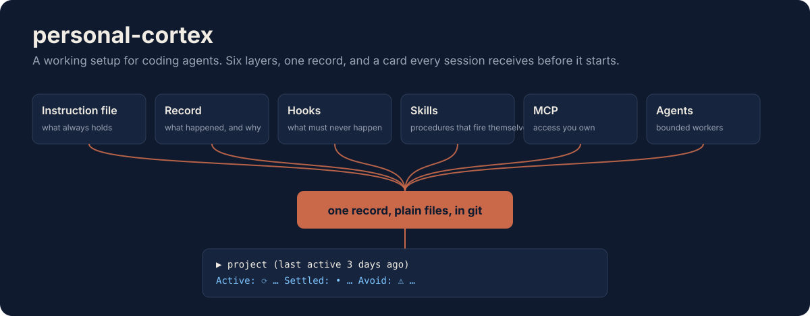
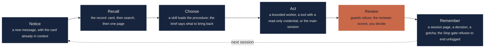
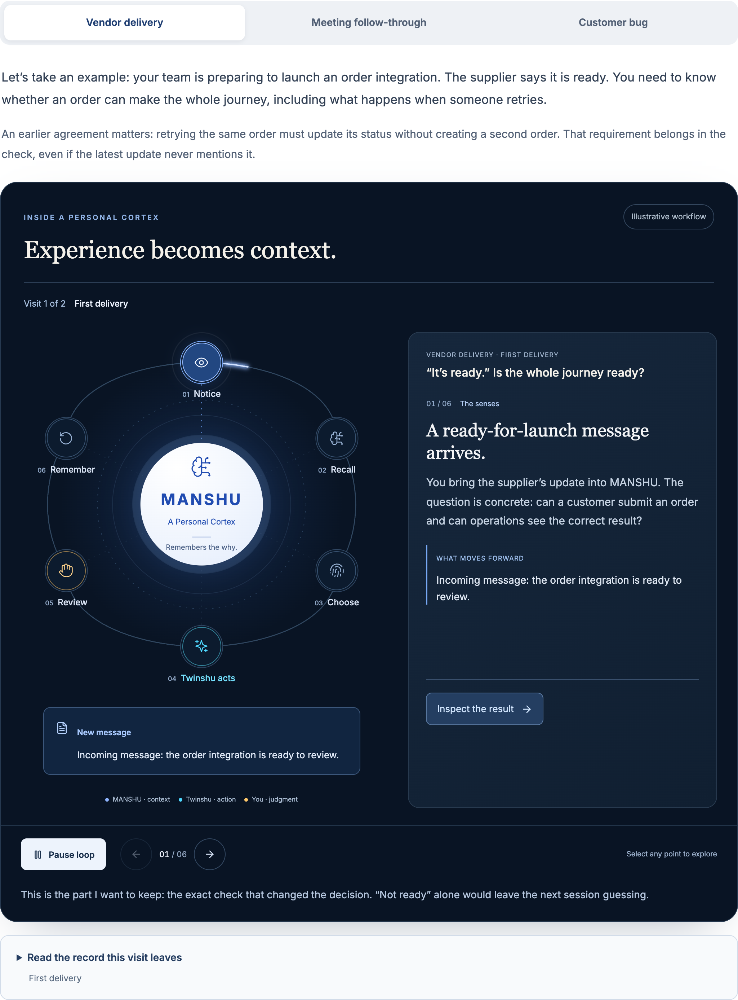

<p align="center">
  
</p>

<p align="center">
  <a href="https://github.com/thehimanshushukla/personal-cortex/actions/workflows/tests.yml"></a>
  
  
  
</p>

**A working setup for coding agents.** A record that outlives the conversation, an instruction file that stays short, and guardrails that actually refuse. Organised by the failure each piece prevents, in three stages you can adopt one at a time.

## What a session sees before you type a word

This is a real card, printed by a session-start hook in one of my own projects. Nothing in it was written for that session. Every line came from the record: the last session page, the task board, the newest decision, the newest trap.

<p align="center">
  
</p>

That is the whole idea in one screen. The session does not reconstruct the project from you. It reads what the last session left behind, and it starts from there.

## Why

Every session starts from zero. Rules get written and ignored. Procedures get forgotten. The reasoning behind a decision gets summarised away. Work does not resume; it gets reconstructed, by you, at the start of every conversation.

Each piece here is the fix for one of those failures, taken from a setup that has run for about a year across client programs and my own products. The reasoning behind every piece is in the [Claude Code setup series](https://thehimanshushukla.com/blog/claude-code-setup-series); the files here are the transferable part.

## Three stages

| | `record/` | `minimal/` | `full/` |
|---|---|---|---|
| For | Anyone, with any agent | You have never written a hook | You run an agent daily, often more than one session at a time |
| You get | An instruction template, a decision record, a session page and a checkpoint template | One instruction file, one guard, one settings file | The full hook set, session tracking, a write ledger |
| Time | Ten minutes | About ten minutes | About an hour |
| Works with | Claude Code, Codex, Cursor, Gemini CLI, anything that opens a file | Claude Code (ports to Codex and Cursor with edits) | Claude Code (ports with edits) |

Start with `record/`. Add `minimal/` when a rule you wrote down gets broken anyway. Move to `full/` when you hit one of the failures below and want it to stop happening. `examples/` holds the small pieces the articles walk through: a skill, a bounded hook with its registration, a review-eligibility check, and their tests.

## How one piece of work goes round



The second time round is the point. The next session inherits the decision, its reason and the next check, instead of your summary of them. The interactive version of this loop, with three worked scenarios across two visits, is in [part 7 of the series](https://thehimanshushukla.com/blog/claude-code-manshu-system).

<p align="center">
  <a href="https://thehimanshushukla.com/blog/claude-code-manshu-system#cortex-loop"></a>
</p>

## Where each layer lives

| Layer | Holds | Loads | Put a thing here when |
|---|---|---|---|
| The instruction file (`AGENTS.md`, imported by `CLAUDE.md`) | Standing instructions | Every session, in full | It changes what the tool does next, and it says why |
| The record (`docs/decisions.md`, then a page per session, decision and trap) | What happened, what was decided, what broke | Never by default; read on demand | It is history, not instruction |
| A hook | An enforced rule | At a fixed lifecycle moment | You have already broken the rule twice with it written down |
| A skill | A procedure | Only when invoked | It is multi-step and needed only sometimes |

The full test for what belongs in the instruction file is in [WHAT-GOES-WHERE.md](WHAT-GOES-WHERE.md).

## The failures these prevent

| Failure | What it looks like | What fixes it |
|---|---|---|
| Your instruction file keeps growing and stops being followed | You add a rule after every bad result. The file passes 200 lines. Rules that matter compete with rules that do not. | `record/AGENTS.template.md` and the belongs-here test in [WHAT-GOES-WHERE.md](WHAT-GOES-WHERE.md) |
| The next session does not know what you decided | You explain the same decision for the third time, because the reasoning only existed in a conversation that got summarised. | `record/decisions.md`, then `record/session.template.md` |
| A rule you wrote is ignored anyway | The rule is in the file, in capitals, and the thing still happens. | A hook. Context is advice; only a hook is enforcement. `minimal/scripts/stage-guard.py` |
| One session commits another session's work | You run two terminals. A directory-level `git add` sweeps up whatever the other one was mid-way through writing. | `stage-guard.py` |
| An agent writes somewhere it should not | A path under `~/.ssh`, `~/.aws`, or a destructive shell command. | `full/scripts/danger-guard.py` |
| You finish a long session and write nothing down | The sessions most worth recording are the ones where you are most tired. | The `Stop` gate in `full/scripts/session-tracking/on-stop.sh` |
| Compaction eats the reasoning | The conversation is summarised and the *why* behind today's decisions is gone. | `record/checkpoint.template.md` and `on-pre-compact.sh`, which writes to disk before the summary |
| You cannot tell which files a session touched | You want to stage precisely and cannot reconstruct what changed. | `on-post-write.py`, a per-session write ledger |

## Stage 1: the record (any agent)

1. Copy `record/AGENTS.template.md` to your project's `AGENTS.md`, merging any existing instructions. If you use Claude Code, make `./CLAUDE.md` a single line: `@AGENTS.md`.
2. Copy `record/decisions.md` to `docs/decisions.md`. Replace the illustrative entry with a real decision, with the reason and the alternative you rejected.
3. Open a fresh session and ask: *what should we do next, why did we choose this direction, and what would make us reconsider?* Check the answer against the record. If it misses the reason, improve the record or its entry point.
4. When one file stops being enough, use `record/session.template.md` for a page per substantial session and `record/checkpoint.template.md` for the running note that survives a compaction.

That fresh-session test is the only measurement you need at this stage. Run it before building anything larger.

## Stage 2: the minimal guard (Claude Code)

```bash
git clone https://github.com/thehimanshushukla/personal-cortex
cd personal-cortex

# 1. instruction file - open it and fill the placeholders
cp minimal/CLAUDE.md ~/.claude/CLAUDE.md

# 2. the guard
mkdir -p ~/.claude/scripts
cp minimal/scripts/stage-guard.py ~/.claude/scripts/
chmod +x ~/.claude/scripts/stage-guard.py

# 3. wire the hook - merge this into ~/.claude/settings.json
cat minimal/settings.json
```

Then verify the guard actually blocks, which is the step people skip:

```bash
echo '{"tool_name":"Bash","tool_input":{"command":"git add ."},"cwd":"'$HOME'/notes"}' \
  | GUARDED_REPO=~/notes python3 ~/.claude/scripts/stage-guard.py; echo "exit: $?"
# expect: a message on stderr and exit 2
```

A guard you have only ever seen allow things is a guard you have not tested.

## Stage 3: the full hook set

`full/` adds the danger guard, the session-start card, the pre-compaction marker, the Stop gate and the write ledger, wired in `full/settings.json`. Each script declares its fail-open or fail-closed choice in its docstring and has a kill switch. Read the docstrings before copying; adapt the paths.

## Portability, honestly

- **The record** is plain markdown in git. Any agent that can open a file can read it. This is the layer that survives switching tools.
- **The instruction file** is `AGENTS.md`. Codex, Cursor and Gemini CLI read it natively; Claude Code imports it with one line.
- **Hooks** use the shape Claude Code, Codex and Cursor now share: a JSON description of the event on stdin, exit code 2 to block, the reason on stderr. Event names, input fields and settings locations differ per agent, so a hook ports with edits, not unchanged. The tests tell you when an edit broke it.
- **Skills** follow the open Agent Skills format; discovery behaviour is per agent, so test it in each one you use.

## Design rules these follow

**Fail open or fail closed, deliberately.** Every guard here declares its choice. These fail *open*: an internal error exits 0 and allows the call, because they protect you from your own automation moving fast. If you adapt one to stand between an attacker and your credentials, change it to fail closed. The question is: if this hook breaks, would you rather lose the work or lose the protection?

**Say what to do instead.** A blocked command with no explanation produces a retry loop. Every refusal here names the safe alternative.

**Exit 0 when it is not your business.** A hook on every Bash call must be cheap and quiet or you will disable it within a week.

**Give it a kill switch.** Each script honours an environment variable that turns it off for one shell.

**Expect a false positive.** When one arrives, check the caller before the rule. A new guard collides first with your own older procedures. If it was a real false positive, prefer changing the workflow that collided over loosening the pattern.

## Tests

```bash
python3 -m pytest tests -q                          # the guards: block, allow, kill switch, fail-open
cd examples && python3 -m unittest -q test_examples.py   # the article examples
```

The Stop gate is tested for the bug that is easy to write: a `Stop` hook with no attempt counter is an infinite loop.

## What this is not

It is not a framework, and there is nothing to install beyond copying files. It is not a substitute for reading [the hooks reference](https://code.claude.com/docs/en/hooks); the exit-code semantics are worth ten minutes. It will not make an agent follow your rules through sheer volume. That is the mistake the instruction-file template exists to prevent.

## Contributing

If something here broke in your setup, open an issue. What people trip over shapes what gets fixed next.

---

Written by [Himanshu Shukla](https://thehimanshushukla.com). The reasoning behind each piece, with the real files and the numbers, is in the [Claude Code setup series](https://thehimanshushukla.com/blog/claude-code-setup-series). MIT licensed.
